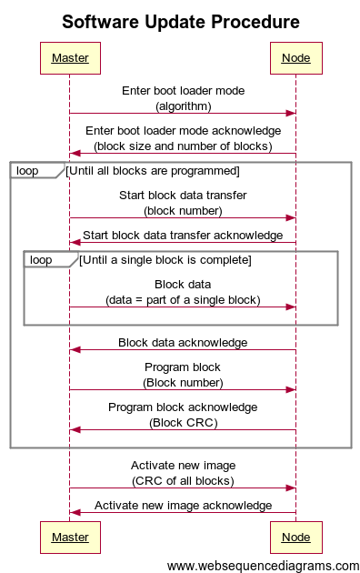
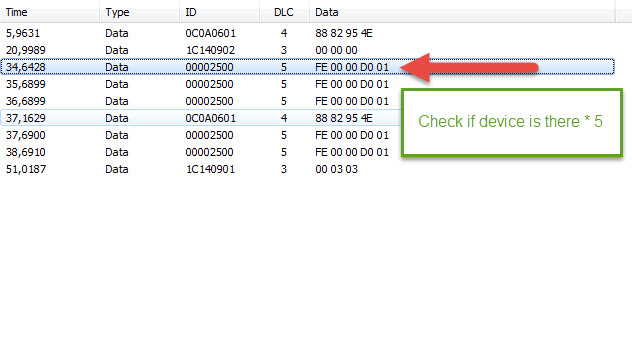
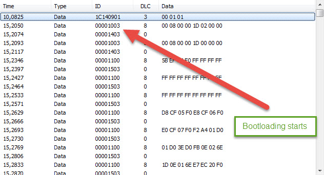
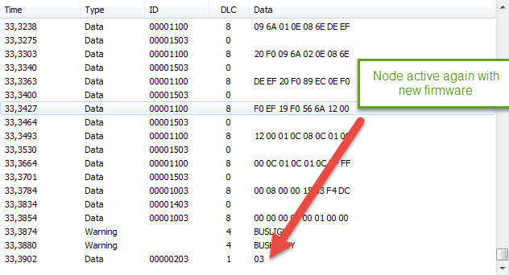

# VSCP boot loader algorithm

This is the VSCP boot loader. Note that also several other low level boot loader mechanisms (such as PIC1 below) that are more suited for low memory footprint devices are available. Many devices  of today have the capability for in circuit programming and can have their firmware changed whilst still in the system. This is supported by VSCP with boot loader events.

Most flash devices are programmed block by block. The boot loader algorithm must support this. Blocks are usually quite small but to be compatible with future devices 16-bit words are used to describe a block size. 16-bit words are also used to describe the number of available blocks. This means that the total Flash size is described by a 32-bit word and the maximum flash size supported is thus four gigabytes.

The boot loader sequence is as follows:

*  **master** - device that initiate boot loading process and uploads firmware

*  **node** - Device that will get it's firmware updated.

 1.  The master instructs the node to enter boot loader mode by sending an [enter boot loader mode](http://www.vscp.org/docs/vscpspec/doku.php?id=class1.protocol#type_12_0x0c_enter_boot_loader_mode) event to the node. This event have information on which boot loader method that is expected by the master. This can be the VSCP boot loader which is described here or another boot loader. __If this event is received in an stage below the boot loading process should be restarted.__
 2.  The node confirms that it is ready for code loading with the requested boot loader algorithm by sending the [ACK boot loader mode](http://www.vscp.org/docs/vscpspec/doku.php?id=class1.protocol#type_13_0x0d_ack_boot_loader_mode) event. Block size and number of blocks are sent as arguments in the acknowledge event. The node respond with [NACK boot loader mode event](http://www.vscp.org/docs/vscpspec/doku.php?id=class1.protocol#type_14_0x0e_nack_boot_loader_mode) if it can't handle the requested boot loader algorithm or because of some other reason cant initiate the boot loading process.
 3.  The master sends a [start block data transfer](http://www.vscp.org/docs/vscpspec/doku.php?id=class1.protocol#type_15_0x0f_start_block_data_transfer) event to specify which block should be programmed and by that initiating the transfer of data for the block. 
 4.  The node confirms block transfer by sending an [ACK data block](http://www.vscp.org/docs/vscpspec/doku.php?id=class1.protocol#type_17_0x11_ack_data_block) event. 
 5.  The master sends one or several [block data](http://www.vscp.org/docs/vscpspec/doku.php?id=class1.protocol#type_16_0x10_block_data) events until the complete block is transferred. 
 6.  When all data for a block is received by a node it sends a [block ACK](http://www.vscp.org/docs/vscpspec/doku.php?id=class1.protocol#type_17_0x11_ack_data_block) event to acknowledge the reception of a complete block. 
 7.  The master now sends a program block event to the node to make it write the block buffer into flash memory. 
 8.  The node confirms the block programming by responding with an [ACK program block](http://www.vscp.org/docs/vscpspec/doku.php?id=class1.protocol#type_20_0x14_ack_program_data_block) event.
 9.  The next block is handled or the node is taken out of the boot loader mode by sending a [drop nickname/reset device](http://www.vscp.org/docs/vscpspec/doku.php?id=class1.protocol#type_8_0x08_drop_nickname-id_reset_device) event. 
 10.  To activate the new program code the master sends an [activate new image](http://www.vscp.org/docs/vscpspec/doku.php?id=class1.protocol#type_22_0x16_activate_new_image) event with the 16 bit CRC for the full new firmware as an argument. The new node should come up after reboot. The 16-bit CCITT CRC is used. [One activate new image ACK](http://www.vscp.org/docs/vscpspec/doku.php?id=class1.protocol#type_48_0x30_activate_new_image_ack) event is set if this happens if something is wrong an [activate new image NACK](http://www.vscp.org/docs/vscpspec/doku.php?id=class1.protocol#type_48_0x30_activate_new_image_ack) event is sent.

The boot-loader is built to direct control flash if other methods such as intermediate storage is used. Data can be loaded direct and program block can just get a dummy ACK. 

Diagram by **Andreas Merkle**

# Microchip custom algorithm for PIC18 devices, Boot loader code = 0x01

    rev 0.3: 2004-09-22

The CAN boot loader is a modified version of a boot loader that Microchip describes in there application note AN247. Source for the boot loader is available at vscp_firmware\pic\bootloader\Microchip\vscp_can_bootloader_18f in the source tree. 

## Changes from Appnote 247

This boot loader is based on the Microchip CAN boot loader for 18F devices that is described in their application note 247 (see references at the end of this document for a pointer to original code and excellent documentation). This work remains much the same but some changes have been made to it to make it suitable for VSCP nodes.

 1.  Message format has been changed to suit the VSCP protocol. 
 2.  Messages from the node uses the node-ID in the origin field. 
 3.  The node sends an initial message at start-up. 
 4.  The boot flag is in EEPROM byte 0 as specified in the VSCP specification. If this position contains 0xff it means enter the bootloader.

The vscpworks application is usable on multiple platforms (Windows, Unix and in the future Macintosh) and can be used to load code into a device. 

To enter boot loader mode a class=0, Type=12, Enter boot loader mode should be sent to the node. The following data should be supplied

*  **Byte 0:** The nickname-ID for the node. 

*  **Byte 1:** 0x01 – Bootloader for Microchip devices type 1 (this bootloader). 

*  **Byte 2:** GUID byte 0 for node (register 0xDF). 

*  **Byte 3:** GUID byte 3 for node (register 0xDC). 

*  **Byte 4:** GUID byte 5 for node (register 0xDA). 

*  **Byte 5:** GUID byte 7 for node (register 0xD7). 

*  **Byte 6:** Content of node register 0x92, Page Select Register MSB 

*  **Byte 7:** Content of node register 0x93, Page Select Register LSB

If the supplied data is correct and this bootloader type is supported on the device, a message class=0, type=13, ACK Boot Loader Mode will be sent from the node.

If something is wrong a class=0, type=14, NACK Boot Loader Mode will be sent.

To indicate that the node is in boot loader mode. It will send a message 0x15nn where nn is its node-ID when it has entered the boot loader. The application should wait for this initial message before it starts its work.

Register 0x97 contains info (the code) about which bootloader algorithm a node support as documented in the VSCP specification for class=0, type=12.. 

## Loading code to a node.

 1.  Send a PUT_BASE_INFO command. The address pointer should be set. The control byte is typically set to 0x1D ( MODE_WRT_UNLOCK, MODE_AUTO_ERASE, MODE_AUTO_INC, MODE_ACK). If CMD_RESET is set the checksum will be tested. This is usually how the first command to the node is formatted. 
 2.  Write data to the device by sending multiple PUT_DATA commands to it. Each byte sent to the node must be summed in order to cater for the checksum. 
 3.  Check that the written data is OK. This can be done by reading the data back or by checking the checksum. If a PUT_BASE_INFO command is sent with CMD_CHK_RUN and with CMD_DATA_LOW/CMD_DATA_HIGH set to ( 0x10000 – (checksum & 0xFFFF) ) the node will check its own calculated checksum and start the application on the node after setting the EEPROM boot info to start-application state. If the checksum fails it will stay in bootloader mode.

The VSCP bootloader wizard handles this task. 

## Filter and Mask settings

If the filter allows messages for all nicknames to come in to the node it is possible to boot load many nodes at the same time. Each node will answer with its node-ID but will only react to packages for node 0xFF and its own ID. In this way it is possible to have part of the programming common for all nodes.

accept only class=0(0x00) type=16(0x10),17(0x11),18(0x18),19(0x12) origin=all 

##### Mask

    EIDL = 0x00 All origins 
    EIDH = 0xFC 
    SIDL = 0xFF 
    SIDH = 0x0f All priorities, either hard coded or not.

##### Filter

    EIDL = 0x00 
    EIDH = 0x10 
    SIDL = 0x08 only extended messages 
    SIDH = 0x00 

Responses are of type 20 and 21. 

## PUT_BASE_INFO

    Priority = 0 
    Hard code = 0 
    Class = 0 
    Type = 16(0x10)

Command ID is 0x000010nn where nn is the nickname for the node that initiated the boot load.

The PUT_BASE_INFO command sets address and flags for a device.

*  **Byte 0:** ADDR_LOW - Low address bits 0-7 

*  **Byte 1:** ADDR_HIGH - High address bits 8-15 

*  **Byte 2:** ADDR_UPPER - Upper address bits 16 - 23 

*  **Byte 3:** reserved 

*  **Byte 4:** CONTROL - Control byte 

*  **Byte 5:** COMMAND - Command 

*  **Byte 6:** CMD_DATA_LOW - Command data 0-7 

*  **Byte 7:** CMD_DATA_HIGH - Command data 8-15

CONTROL is defined as follows

*  **Bit 0:** MODE_WRT_UNLCK Set this to allow memory write and erase. 

*  **Bit 1:** MODE_ERASE_ONLY Set this to only erase program memory on a put command. Must be on a 64-bit boundary. 

*  **Bit 2:** MODE_AUTO_ERASE Set this to automatically erase program memory while writing data. 

*  **Bit 3:** MODE_AUTO_INC Set this to automatically increment the pointer after a write. 

*  **Bit 4:** MODE_ACK Set to get acknowledge. 

*  **Bit 5:** undefined. 

*  **Bit 6:** undefined. 

*  **Bit 7:** undefined. 

COMMAND is defined as follows

*  **0x00:** CMD_NOP No operation – Do nothing 

*  **0x01:** CMD_RESET Reset the device. 

*  **0x02:** CMD_RST_CHKSM Reset the checksum counter and verify. 

*  **0x03:** CMD_CHK_RUN Add checksum to CMD_DATA_LOW and CMD_DATA_HIGH, if verify and zero checksum then clear the last location of EEDATA.

Send this command first with the base address and MODE_WRT_UNLCK to be able to write to memory.

If MODE_AUTO_ERASE is set the memory pointer will auto increment after each write.

If MODE_ACK is set then ack messages will be sent from the node after the write. Response messages has the form 0x000014nn where nn is node nickname-ID.

To only erase but not write set MODE_ERASE_ONLY

if MODE_AUTO_INC is set, the memory pointer will increment automatically. 

## PUT_DATA

    Priority = 0 
    Hardcode = 0 
    Class = 0 
    Type = 17(0x11)

Command ID is 0x000011nn where nn is the nickname for the node that initiated the boot load.

This command writes data to memory.

The PUT_DATA command sets address and flags for a device.

*  Byte 0: D0 - Data byte 0 

*  Byte 1: D1 - Data byte 1 

*  Byte 2: D2 - Data byte 2 

*  Byte 3: D3 - Data byte 3 

*  Byte 4: D4 - Data byte 4 

*  Byte 5: D5 - Data byte 5 

*  Byte 6: D6 - Data byte 6 

*  Byte 7: D7 - Data byte 7

If MODE_ACK is set then ack messages will be sent from the node after the write. Response messages has the form 0x000015nn where nn is node nickname-ID.

If MODE_AUTO_INC is set the memory pointer will increase automatically and one can issue multiple PUT_DATA after each other until the flash is written. 

## GET_BASE_INFO

    Priority = 0 
    Hardcode = 0 
    Class = 0 
    Type = 18(0x12)

Command ID is 0x000012nn where nn is the nickname for the node that initiated the boot load.

This command gets the base info from the node. There is no data for this command.

The response is:

*  **Byte 0:** ADDR_LOW - Low address bits 0-7 

*  **Byte 1:** ADDR_HIGH - High address bits 8-15 

*  **Byte 2:** ADDR_UPPER - Upper address bits 16 - 23 Byte 3: reserved

*  **Byte 4:** CONTROL - Control byte Byte 5: reserved 

*  **Byte 6:** reserved 

*  **Byte 7:** reserved

with ID 0x000010nn where nn is nickname. 

## GET_DATA

    Priority = 0 
    Hardcode = 0 
    Class = 0 
    Type = 19(0x13)

Command ID is 0x000013nn where nn is the nickname for the node that initiated the boot load.

This command gets data at the pointer from the node. There is no data for this command.

The response is:

*  **Byte 0:** D0 - Data byte 0 

*  **Byte 1:** D1 - Data byte 1 

*  **Byte 2:** D2 - Data byte 2 

*  **Byte 3:** D3 - Data byte 3 

*  **Byte 4:** D4 - Data byte 4 

*  **Byte 5:** D5 - Data byte 5 

*  **Byte 6:** D6 - Data byte 6 

*  **Byte 7:** D7 - Data byte 7

The ID has the form 0x000011nn where nn is node nickname-ID.

If MODE_AUTO_INC is set the memory pointer will increase automatically and one can issue multiple PUT_DATA after each other until the flash is written.

A node that implements the bootloader but does not want to share memory content can report all data as 0xFF. 

##### Memory Organization

	
	|-------------------------------| 
	|                               | 0x000000 (Do not write here!)
	|           Boot Area           |
	|                               |
	|-------------------------------| 
	|                               | 
	|                               | 
	|                               | 
	|                               | 
	|         Prog Mem              | 
	|                               | 
	|                               | 
	|                               | 
	|                               | 0x1FFFFF 
	|-------------------------------| 
	|          User ID              | 0x200000 
	|-------------------------------| 
	|:::::::::::::::::::::::::::::::| 
	|:::::::::::::::::::::::::::::::| 
	|-------------------------------| 
	|          Config               | 0x300000 
	|-------------------------------| 
	|:::::::::::::::::::::::::::::::| 
	|:::::::::::::::::::::::::::::::| 
	|-------------------------------| 
	|         Device ID             | 0x3FFFFE 
	|-------------------------------| 
	|:::::::::::::::::::::::::::::::| 
	|:::::::::::::::::::::::::::::::| 
	|:::::::::::::::::::::::::::::::| 
	|:::::::::::::::::::::::::::::::| 
	|-------------------------------| 
	|                               | 0xF00000 
	|          EEDATA               | 
	|         (remapped)            | 
	|                               | (Last byte used as boot flag) 
	|-------------------------------|

##### VSCP Works

VSCP will start the boot loading process for all algorithms by checking if the device is present. This is done by reading register 0xD0 which is the first byte of the GUID and for a valid VSCP device it should always return something. 

The picture above show this in a CAN monitor

The purpose is to see if an MDF is available which automatically can supply some data about the device. This is normally true but not so for a device that is set in boot mode physically or by some other means.

The boot loading always start by trying to set the device in boot loader mode. This is done by sending CLASS1.PROTOCOL, Type=25, Set device in boot loader mode. For now hardware this has no value as it is not running VSCP yet so in that case the boot loading process is just tried even if the device does not acknowledge that it is going into boot loader mode.

In the last step the boot loader is leaving the boot loader firmware and goes up to VSCP domain. This is shown here

For a node that comes from the VSCP domain, that is preserve it's nickname, VSCP Works is able to determine if the node comes alive again. For a node that need to discover a nickname this is not possible.

## References

Bootloader source code is available on [GitHUB](https///github.com/grodansparadis/vscp_pic1_bootloader). 

The Microchip application note AN247 is the base work for this application. It and its accompanying source can be found at [http://ww1.microchip.com/downloads/en/AppNotes/00247a.pdf](http://ww1.microchip.com/downloads/en/AppNotes/00247a.pdf)



