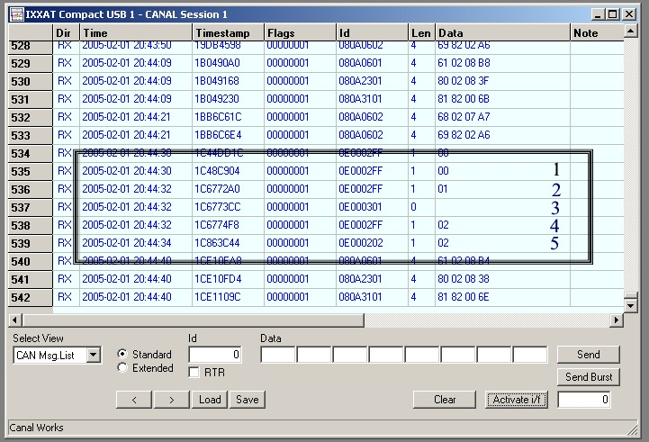

# VSCP Level I Specifics

## Level I node types

Each Level I segment can contain two types of nodes: dynamic nodes and hard-coded nodes.

### Dynamic nodes

Dynamic nodes are the most common node type. A dynamic node conforms fully to the Level I specification and has:

* A GUID.
* The VSCP register model.
* All or most class 0 control events. At a minimum, the node should implement register read/write and the events used for nickname discovery.
* The hard-coded bit cleared in its CAN ID.
* A response to a probe event addressed to its assigned nickname. The response is a probe ACK with the hard-coded bit set.

Sample implementations are available at [vscp.org](https://www.vscp.org).

### Hard-coded nodes

VSCP hard-coded nodes have a nickname that is set in hardware and cannot be changed.

Hard-coded nodes can be very simple to implement. Typical examples are a node that periodically sends an event and a button node that sends an on event when the button is pressed.

## Address or nickname assignment

Every node on a VSCP network segment needs a nickname ID. The process of assigning and verifying this ID is called nickname discovery.

A Level I segment can contain up to 254 dynamically addressed nodes and an additional 254 hard-coded nodes. A segment may have a master that assigns nicknames, but a master is not required.

After receiving a nickname, a node should store it in non-volatile memory and continue using it until instructed to stop. If a node loses its nickname, the segment controller must be able to assign it again. To do this, the controller stores the node's full GUID.

### Dynamic-node initialization

When a new dynamic node is added to a segment, the following procedure is used.

#### Step 1

The process starts when a button or similar control is activated on the node. If the node already has a nickname, it forgets that nickname and enters the initialization state. An uninitialized node uses the reserved node ID `0xFF`.

#### Step 2

The node sends a [CLASS1.PROTOCOL, type 2 Probe](./class1.protocol?id=type2) to address `0`, which is reserved for the segment master. The node uses `0xFF` as its own address and sends the probe at priority `0x07`. If a master is available, it can assign a nickname using [CLASS1.PROTOCOL, type 6 Set Nickname](./class1.protocol?id=type6). A one-second response interval is a reasonable starting point.

If no master assigns a nickname, the node checks the available nicknames (`1` through `253`) in sequence. For each candidate nickname, it listens for a [CLASS1.PROTOCOL, type 3 Probe ACK](./class1.protocol?id=type3) for one second. If no ACK is received, the node assumes that the nickname is free and assigns it to itself. The timeout may be increased for slower media.

The node should provide a visual indication of success. For example, a green LED can blink during discovery and remain steadily lit after the node receives a nickname. If every address is occupied, the node reports a segment-full condition and enters a low-power or inactive state.

On insecure media such as RF, and as a good practice on CAN, the probe should be sent several times to confirm that the nickname is free. At least three probe attempts are recommended for low-level protocols.

#### Step 3

After assigning a nickname, the node sends a nickname-accepted event using its new nickname to announce its identity to the segment.

#### Step 4

Other nodes can now query the new node's capabilities using register read and related commands.

Only one node should go through the active initialization process at a time.

The following picture shows the nickname discovery process for a newly added node on a segment

#### Node discovery example

1. The uninitialized node, using nickname `0xFF`, probes for a segment controller with class 0, type 2.
2. No segment controller responds, so the node probes nickname `1` with class 0, type 2.
3. A node already using nickname `1` responds with a probe ACK, class 0, type 3. The initializing node therefore knows that nickname `1` is occupied.
4. The node probes nickname `2` with class 0, type 2.
5. No ACK is received, so the node assigns nickname `2` to itself and announces that a new node is online.

For large installations, it is often preferable to preassign nicknames. Connect each node to a PC or similar tool and assign its nickname before installation. The node can then use that nickname for its operational lifetime, unless it is explicitly changed.

### Hard-coded-node initialization

Hard-coded nodes follow a simpler initialization process.

If a hard-coded node has an address set in hardware, it can start operating on the segment immediately.

If a hard-coded node also implements nickname discovery, it follows steps 1-3 of the dynamic-node procedure. All hard-coded nodes on the segment must recognize and respond to probe events.

The hard-coded bit must always be set for a hard-coded node, regardless of whether nickname discovery is implemented.

### Silent dynamic nodes

In some installations, especially RS-485 segments, it is useful for a module to start as a silent node. A silent node listens to traffic but does not begin nickname discovery when it is powered on. Instead, it waits for the CLASS1.PROTOCOL, type 23 event (GUID drop nickname ID / reset device). When it receives the complete event sequence and the GUID matches its own, it starts the dynamic nickname-discovery procedure described above.

This allows software to search for and initialize a module after the user provides its GUID. If the manufacturer's GUID prefix is known, the user may only need to enter the final four bytes and select the manufacturer.

Active nickname discovery remains the preferred approach because it supports automatic node discovery without user intervention.

The following example shows how the silent-node procedure works.

Assume two nodes are assigned unique identifiers derived from their serial numbers:

* Node 1 has serial number `0001`.
* Node 2 has serial number `0002`.

Combined with your GUID this will be

* Node 1 has GUID `aa bb cc dd 00 00 00 00 00 00 00 00 00 00 00 01`.
* Node 2 has GUID `aa bb cc dd 00 00 00 00 00 00 00 00 00 00 00 02`.

When the nodes start, they detect that they have no assigned nickname (`0xFF`) and remain silent while listening for commands.

When your PC app. want to initialize the new nodes it sends

* CLASS1.PROTOCOL type 23, data `00 aa bb cc dd`
* CLASS1.PROTOCOL type 23, data `01 00 00 00 00`
* CLASS1.PROTOCOL type 23, data `02 00 00 00 00`
* CLASS1.PROTOCOL type 23, data `03 00 00 00 01`

The first node now enters initialization and tries to discover a nickname using `0xFF` as its current nickname.

It sends several CLASS1.PROTOCOL type 2 probes, starting with `0` (the server address) and increasing the candidate nickname while CLASS1.PROTOCOL type 3 responses indicate that an address is occupied.

If it is the first node on the bus, it claims nickname `1`. The node should normally store this value in EEPROM and reuse it the next time it starts.

The PC now continue with the other node sending

* CLASS1.PROTOCOL type 23, data `00 aa bb cc dd`
* CLASS1.PROTOCOL type 23, data `01 00 00 00 00`
* CLASS1.PROTOCOL type 23, data `02 00 00 00 00`
* CLASS1.PROTOCOL type 23, data `03 00 00 00 02`

The second node starts its initialization procedure and finds a free nickname.

This process is normally needed only when a new node is first installed on the bus. On subsequent starts, the node uses the nickname stored in non-volatile memory.

If a PC is always present, it can send CLASS1.PROTOCOL type 6 to the uninitialized node when the node probes the server with CLASS1.PROTOCOL type 2 using probe ID `0xFF` and origin `0xFF`.

## Example: lighting control

A typical segment without a master might control lighting in a large room with several switches. During installation, each switch is initialized and assigned a nickname.

Each switch checks the segment for a free nickname and stores the assigned value in non-volatile memory. The installer records the nicknames, although specific nicknames may also be assigned manually.

VSCP-aware relay nodes are then installed and initialized to control the lights. Their nicknames are recorded as well.

At this stage, the switches and relay nodes are not yet associated. Pressing a switch sends an on event, but the relays do not yet know how to respond.

This association is configured by adding decision-matrix entries to the relay nodes:

* If an on event is received from node `n1`, turn the relay on.
* If an on event is received from node `n2`, turn the relay on.
* If an on event is received from node `n3`, turn the relay on.

The corresponding off-event entries are:

* If an off event is received from node `n1`, turn the relay off.
* If an off event is received from node `n2`, turn the relay off.
* If an off event is received from node `n3`, turn the relay off.

Because the decision matrix is stored in non-volatile memory, this configuration remains active until it is changed.

When the controlled lights provide a visible indication, switches do not need to send separate on and off events. They can send only an on event and let the relay decide what to do. The decision matrix can then use toggle actions:

* If an on event is received from node `n1`, toggle the relay state.
* If an on event is received from node `n2`, toggle the relay state.
* If an on event is received from node `n3`, toggle the relay state.

If a switch needs its own status indication, such as when controlling a boiler, it can monitor events from the controlled device. Its decision matrix can contain:

* If an on event is received from node `s1`, turn the status light on.
* If an off event is received from node `s1`, turn the status light off.

Adding another switch is straightforward, and zones can simplify the configuration further. Each switch event can include the zone it controls. The decision matrix can then use a zone instead of a specific nickname:

* If an on event is received for zone `x1`, turn on the relay.

This makes the installation easier to extend or reconfigure.

### Extending the example

To control the lights from a PC, send the same on event to the zone. The relay and switches respond as if another switch had been added.

A remote control can use a decision-matrix entry that sends the zone's on event when a selected key is pressed.

To turn the lights on when an alarm is triggered, configure the alarm controller to send the zone's on event.

The same approach can be used for other event sources. The decision matrix defines how those sources interact with the lighting system.

[filename](./bottom_copyright.md ':include')`
