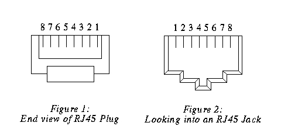

# VSCP over CAN (CAN4VSCP)

The maximum number of nodes VSCP can handle is 254. In practice, the number of nodes that can be connected to a CAN bus depends on the minimum load resistance a transceiver is able to drive. This is typically around 120 depending on all the transceivers and media (cables) used.

The transmission speed (or nominal bit rate) **should be set to 125 kilobits per second** (8 uS bit time). 

The maximum length of the cabling in a segment is typically 500 meters using AWG24 or similar (CAT5) and a nominal bit rate of 125kbps. Drops with a maximum length of 24 meters can be taken from this cable and the sum of all drops must not exceed a total of 120 meters counted together. 

 | Bit Rate     | Max Bus Length (m) | Max Drop Length (m) | Max Cumulative Drop Length (m) | 
 | --------     | ------------------ | ------------------- | ------------------------------ | 
 | 1Mbps        | 25                 | 2                   | 10                             | 
 | 800 Kbps     | 50                 | 3                   | 15                             | 
 | 500 Kbps     | 100                | 6                   | 30                             | 
 | 250 Kbps     | 250                | 12                  | 60                             | 
 | **125 Kbps** | **500**            | **24**              | **120**                        | 
 | 50 Kbps      | 1000               | 60                  | 300                            | 
 | 20 Kbps      | 2500               | 150                 | 750                            | 
 | 10 Kbps      | 5000               | 300                 | 1500                           | 

*CAN bit rate data*

The bit rate table is for reference only. CAN4VSCP uses 125 kbit.

The cable should be terminated at both ends with 120 ohm resistors. VSCP uses Extended Data Frames with a 29-bit ID. The protocol is compatible with elementary CAN nodes such as the Microchip MCP2502x/5x I/O CAN expander. Just as for CANopen and DeviceNet, the sample point should be set at 87.5%. 

### Format of the 29 bit CAN identifier in VSCP

 | Bit | Use                 | Comment                                                                                                                                                                                                                                                    | 
 | --- | ---                 | -------                                                                                                                                                                                                                                                    | 
 | 28  | Priority            | Highest priority is 000b (=0) and lowest is 111b (=7)                                                                                                                                                                                                      | 
 | 27  | Priority            |                                                                                                                                                                                                                                                            | 
 | 26  | Priority            |                                                                                                                                                                                                                                                            | 
 | 25  | Hard-coded          | If this bit is set the nickname-ID of the device is hard-coded                                                                                                                                                                                             | 
 | 24  | VSCP-Class          | The class identifies the event class. There are 512 possible classes. This is the MSB bit of the class.                                                                                                                                                    | 
 | 23  | VSCP-Class          |                                                                                                                                                                                                                                                            | 
 | 22  | VSCP-Class          |                                                                                                                                                                                                                                                            | 
 | 21  | VSCP-Class          |                                                                                                                                                                                                                                                            | 
 | 20  | VSCP-Class          |                                                                                                                                                                                                                                                            | 
 | 19  | VSCP-Class          |                                                                                                                                                                                                                                                            | 
 | 18  | VSCP-Class          |                                                                                                                                                                                                                                                            | 
 | 17  | VSCP-Class          |                                                                                                                                                                                                                                                            | 
 | 16  | VSCP-Class          |                                                                                                                                                                                                                                                            | 
 | 15  | VSCP-Type           | The VSCP-type identifies the type of the event within the set event class. There are 256 possible types within a class. This is the MSB bit of the type.                                                                                                   | 
 | 14  | VSCP-Type           |                                                                                                                                                                                                                                                            | 
 | 13  | VSCP-Type           |                                                                                                                                                                                                                                                            | 
 | 12  | VSCP-Type           |                                                                                                                                                                                                                                                            | 
 | 11  | VSCP-Type           |                                                                                                                                                                                                                                                            | 
 | 10  | VSCP-Type           |                                                                                                                                                                                                                                                            | 
 | 9   | VSCP-Type           |                                                                                                                                                                                                                                                            | 
 | 8   | VSCP-Type           |                                                                                                                                                                                                                                                            | 
 | 7   | Originating-Address | The address is a unique address in the system. It can be a hard-set address or (hard-coded bit set) or an address retrieved through the nickname discovery process. 0x00 is reserved for a segment master node. 0xFF is reserved for no assigned nickname. | 
 | 6   | Originating-Address |                                                                                                                                                                                                                                                            | 
 | 5   | Originating-Address |                                                                                                                                                                                                                                                            | 
 | 4   | Originating-Address |                                                                                                                                                                                                                                                            | 
 | 3   | Originating-Address |                                                                                                                                                                                                                                                            | 
 | 2   | Originating-Address |                                                                                                                                                                                                                                                            | 
 | 1   | Originating-Address |                                                                                                                                                                                                                                                            | 
 | 0   | Originating-Address |                                                                                                                                                                                                                                                            | 

If addressing of a particular node is needed the nickname address for the node is given as the first byte in the data part. This is a rare situation for VSCP and is mostly used in the register read/write events. 

### RJ-XX pin-out

Recommended connector is RJ-34/RJ-12 or RJ-11 with pinout as in this table.

 | Pin   | Use       | RJ-11 | RJ-12 | RJ-45 | Patch Cable wire color T568B | 
 | ---   | ---       | ----- | ----- | ----- | ---------------------------- | 
 | 1     | +9-28V DC |       |       | RJ-45 | Orange/White                 | 
 | 2 1   | +9-28V DC |       | RJ-12 | RJ-45 | Orange                       | 
 | 3 2 1 | +9-28V DC | RJ-11 | RJ-12 | RJ-45 | Green/White                  | 
 | 4 3 2 | CANH      | RJ-11 | RJ-12 | RJ-45 | Blue                         | 
 | 5 4 3 | CANL      | RJ-11 | RJ-12 | RJ-45 | Blue/White                   | 
 | 6 5 4 | GND       | RJ-11 | RJ-12 | RJ-45 | Green                        | 
 | 7 6   | GND       |       | RJ-12 | RJ-45 | Brown/White                  | 
 | 8     | GND       |       |       | RJ-45 | Brown                        | 

Note that the schematics drawings for VSCP modules use a symbol that is numbered looking from the PCB side. It thus appear as to be numbered in the other direction but is actually the same.

Note also that CANopen specify a different schema [http://www.cd-systems.com/Can/can-cables.htm](http://www.cd-systems.com/Can/can-cables.htm) which is opposite numbered VSCP but they are actually the same. We use the numbering that look into the female connector and count from the left. They use the Arabic style and count from the right.

Always try to use a pair of wires for CANH/CANL fort best noise immunity. If the EIA/TIA 56B standard is used this condition will be satisfied. This is good as most Ethernet networks already is wired this way. 

### Using alternative bit-rates

**Don't!** The bit-rate should be fixed at 125kbps. 8 microsecond bit time.



